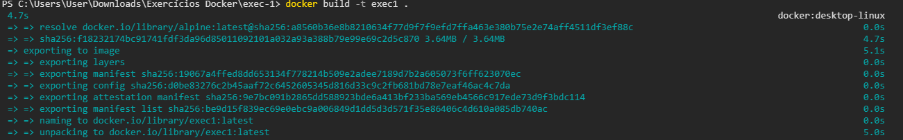
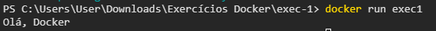

## 1. Crie um arquivo Dockerfile que utilize a imagem alpine como base e imprima a mensagem Olá, Docker! ao ser executada. Construa a imagem com o nome meu-echo e execute um container a partir dela.

### Passo a passo:
- Criar  uma pasta para armazenar o arquivo Dockerfile
- Escrever os seguintes comandos

```Dockerfile
FROM alpine
CMD ["echo", "Olá, Docker"]
```

- Entrar na pasta
```
cd exec-1
```

- Construir a imagem:
```
docker build -t exec1
```



- Executar o container
```
docker run exec1
```



### Referências

- [How yo use the alpine docker oficcial image](https://www.docker.com/blog/how-to-use-the-alpine-docker-official-image/)