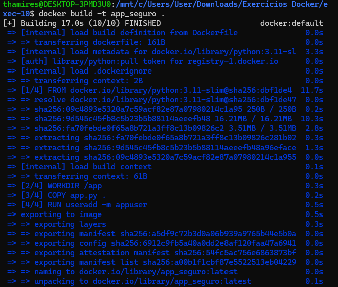
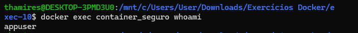

## 10. Ao rodar containers com o usuário root, você expõe seu sistema a riscos maiores em caso de comprometimento. Neste exercício, você deverá criar um Dockerfile para uma aplicação simples (como um script Python ou um servidor Node.js) e configurar a imagem para rodar com um usuário não-root.

- Criar um diretório para adicionar o Dockerfile

- Criar um usuário com useradd ou adduser no Dockerfile e definir esse usuário como o padrão com a instrução USER.
```dockerfile
# Imagem base do Python
FROM python:3.11-slim

# Diretório de trabalho no container
WORKDIR /app

# Copia o script para o container
COPY app.py .

# Cria um usuário com useradd
RUN useradd -m appuser

# Define o usuário como padrão
USER appuser

# Executa o script
CMD ["python", "app.py"]
```

- Criar o arquivo app.py
```python
print("Olá, mundo seguro!")
```

- Construir a imagem
```bash
docker build -t app_seguro .
```

- Construção da imagem:



- Iniciar o container
```bash
docker run -d --name container_seguro app_seguro
```

- Verificar o usuário em execução
```bash
docker exec container_seguro whoami
```

- Verificar se o processo está rodando com o novo usuário usando docker exec <container> whoami.

