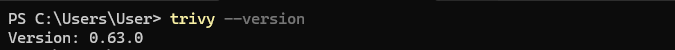
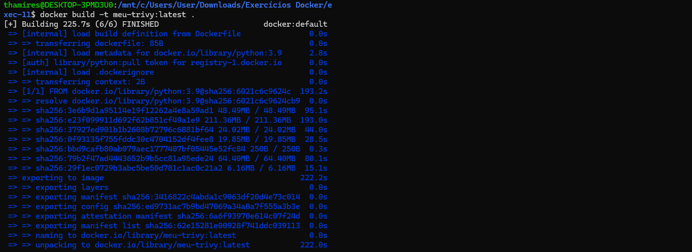
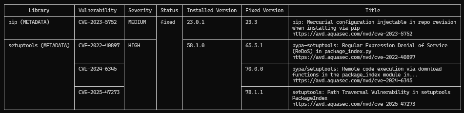

## 11. Trivy é uma ferramenta open source para análise de vulnerabilidades em imagens Docker. Neste exercício, você irá analisar uma imagem pública, como python:3.9 ou node:16, em busca de vulnerabilidades conhecidas.

### Instalar o Trivy na sua máquina (via script ou pacote).

[Faça o Download do Trivy](@https://github.com/aquasecurity/trivy/releases)


- Depois de instalar:
    1. Pressionar Win + R
    2. Digitar sysdm.cpl (comando para abrir as propriedades do sistema)
    3. Clicar em "Variáveis de ambiente" e depois em "Path"
    4. Clicar em "novo" e colar o caminho da pasta do Trivy
    5. Clicar em Ok e fechar o terminal
    6. Testar se o Trivy está funcionando



- Rodar trivy image <nome-da-imagem> para analisar
```powershell
trivy image python:3.9
```

- Criar uma imagem
```bash
docker build -t meu-trivy:latest .
```



### Identificar vulnerabilidades com severidade HIGH ou CRITICAL
```bash
trivy image --severity HIGH, CRITICAL python:3.9
```



### Anotar os pacotes ou bibliotecas afetadas e sugerir possíveis ações (Exs.: atualização da imagem base, substituição de dependências)

#### Soluções:
1. Atualizar os pacotes Python no Dockerfile
```dockerfile
RUN pip install --upgrade pip setuptools 
```

2. Usar imagens mais seguras:
```dockerfile
FROM python:3.11-slim
```

### Referências

> Youtube: [Configurando as variáveis de ambiente no Windows](https://www.youtube.com/watch?v=ing2pLCrvxo)
