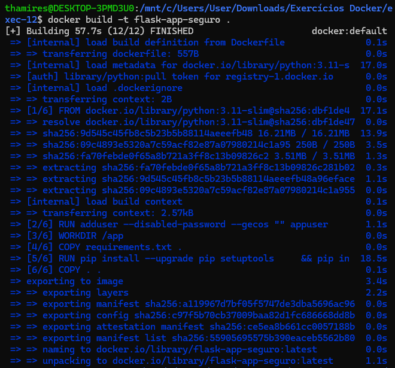
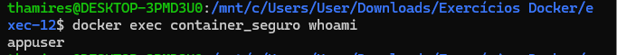

## 12. Após identificar vulnerabilidades com ferramentas como o Trivy, o próximo passo é corrigi-las. Imagens grandes e genéricas frequentemente trazem bibliotecas desnecessárias e vulneráveis, além de usarem o usuário root por padrão. Neste exercício, você irá trabalhar com um exemplo de Dockerfile com más práticas e aplicar melhorias para construir uma imagem mais segura e enxuta. Identifique as melhorias e gere uma nova versão de Dockerfile

- Problemas no Dockerfile:
1. Imagem base desatualizada e grande
2. Usuário root
3. Bibliotecas vulneráveis
4. Sem limpeza de cache
5. Sem verificação de integridade

- Criar um arquivo Dockerfile seguro e otimizado
```dockerfile
# 1. Imagem base mais leve e atualizada (Debian Bookworm)
FROM python:3.9-slim-bookworm

# Cria usuário não-root
RUN adduser --disable-password --gecos "" appuser

# Define diretório de trabalho
WORKDIR /app

# Copia e instala dependências de forma segura
COPY requirements.txt .

RUN pip install --upgrade pip setuptools \
    && pip install --no-cache-dir -r requirements.txt

# Copia o restante da aplicação
COPY . .

# Define usuário não-root
USER appuser

# Define comando de execução
CMD ["python", "app.py"]
```

- Atualização no arquivo requirements.txt
```txt
flask
```

- Formatar app.py
```python
from flask import Flask

app = Flask(__name__)

@app.route("/")
def hello_world():
    return "<p>Hello, World!</p>"
```

- Construir a imagem:
```bash
docker build -t flask-app-seguro .
```

- Construção da imagem:



- Executar e testar o container
```bash
docker run -d --name container_seguro -p 5000:5000 app_seguro
```

- Verificar usuário:
```bash
docker exec container_seguro whoami
```

- Saída:

