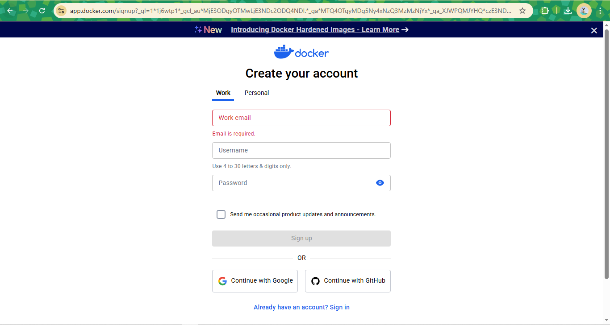

## 13. Crie um Dockerfile que use a imagem python:3.11-slim, copie um script Python local (app.py) e o execute com CMD. O script pode imprimir a data e hora atual.

- Crie uma conta no Docker Hub
1. Acessar o [Docker Hub](https://hub.docker.com/)
2. Clicar em 'Sign Up'
3. Escolher se a sua conta será Work ou Personal
4. Inserir seus dados pessoais e clicar em 'Sign Up'

- Captura de tela



- Fazer login via terminal, inserir seu username e password quando solicitado
```bash
docker login
```

- Login via terminal:


- Criar um arquivo Dockerfile
```bash
FROM python:3.11-slim
WORKDIR /app
COPY app.py
CMD ["python", "./app.py"]
```

- Criar o app.py
```python
from datetime import datetime

def main():
    data_hora_atual = datetime.now()
    print(f"Data e hora atuais: {data_hora_atual.strftime('%d/%m/%Y %H:%M:%/S')}")

    if __name__ == "__main__":
        main()
```

- Rebuild sua imagem meu-echo e a renomeie no formato seu-usuario/meu-echo:v1
```bash
docker build -t seu-usuario/meu-echo:v1 .
```


- Faça o push da imagem para o Docker Hub
```bash
docker push seu-usuario/meu-echo:v1
```

### Referências:

- [How to dockerize your python applications](https://www.docker.com/blog/)
- [Aprenda Docker do Zero ao Avançado](https://www.udemy.com/course/docker-zero-avancado/)