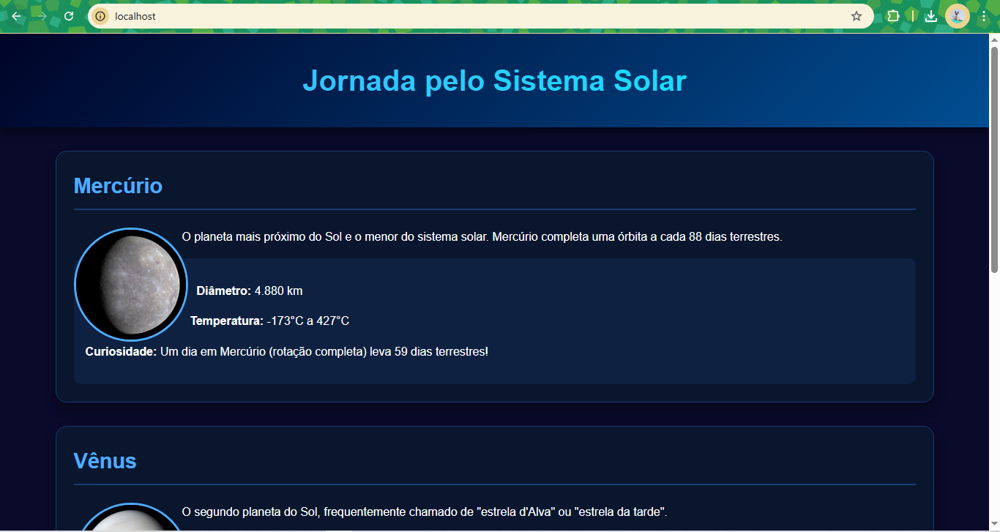

## 2. Crie um container com Nginx que sirva uma página HTML customizada (index.html). Monte um volume local com esse arquivo para que ele apareça na raiz do site (/usr/share/nginx/html). Acesse a página via http://localhost.

## Passo a passo:
- Criar um diretório 
```bash
mkdir nome-do-projeto
```

- Entrar no diretório
```bash
cd nome-do-projeto
nano index.html
```

- Criar o arquivo HTML e personalizar como quiser
```html
<!DOCTYPE html>
<html lang="en">
<head>
    <meta charset="UTF-8">
    <meta name="viewport" content="width=device-width, initial-scale=1.0">
    <title>Página Customizada</title>
    <style>
        body {
            font-family: Arial, sans-serif;
            text-align: center;
            margin-top: 50px;
            background-color: #f0f8ff;
        }
        h1 {
            color: #2e8b57;
        }
    </style>
</head>
<body>
    <h1>Bem-vindo ao Meu Site Customizado!</h1>
    <p>Esta página está sendo servida a partir de um container Nginx.</p>
    
</body>
</html>
```
## Minha página personalizada


- Executar o container Nginx com volume
```bash
docker run -d --name my-nginx \
-p 80:80 \
-v $(pwd)/index.html:/usr/share/nginx/html/index.html \
  nginx
```

- Verificar se o container está rodando
```bash
docker ps
```

- Acessar a página
```bash
http://localhost
```

- Testes com o container:
### Parar o container
```bash
docker stop my-nginx
```

### Iniciá-lo novamente
```bash
docker start my-nginx
```

### Referências

[Crie Seu Próprio Container NGINX com Docker Compose](https://blog.rosnertech.com.br/arquivos/1246)