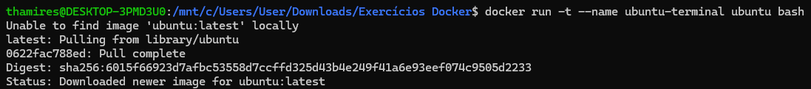

## 3. Inicie um container da imagem ubuntu com um terminal interativo (bash). Navegue pelo sistema de arquivos e instale o pacote curl utilizando apt.

### Passo a passo:

- Iniciar um container da imagem Ubuntu com um terminal interativo
```bash
docker run -t --name ubuntu-terminal ubuntu bash
```

```-it```: Modo interativo com terminal

```--name ubuntu-```: Nome do container

```ubuntu```: Imagem utilizada

```bash```: Shell a ser executado

- Captura de tela:



-  Atualizar os pacotes
```bash
apt update
```

- Instalar o curl
```bash
apt install -y curl
```

- Para verificar a instalação
```bash
curl --version
which curl
```


- Acessar o container e iniciar
```bash
docker exec -it ubuntu-terminal bash
docker start ubuntu-terminal
docker exec -it ubuntu-terminal bash
```

- Navegar e ver arquivos
```bash
ls -l
cd /caminho/
pwd 
```