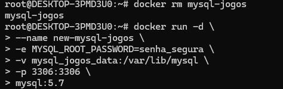
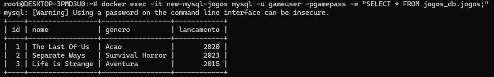

## 4. Suba um container do MySQL (pode usar a imagem mysql:5.7), utilizando um volume nomeado para armazenar os dados. Crie um banco de dados, pare o container, suba novamente e verifique se os dados persistem.

- Criar um volume
```bash
docker volume create mysql_jogos_data
```

- Subir o container MySQL 5.7
```bash
docker run -d \
  --name mysql-jogos \
  -e MYSQL_ROOT_PASSWORD=senha_segura \
  -e MYSQL_DATABASE=jogos_db \
  -e MYSQL_USER=gameuser \
  -e MYSQL_PASSWORD=gamepass \
  -v mysql_jogos_data:/var/lib/mysql \
  -p 3306:3306 \
  mysql:5.7
```

- Acessar o container
```bash
docker exec -it mysql-jogos mysql -u gameuser -pgamepass
```

- Digitar a senha e executar
```bash
CREATE TABLE jogos (
  id INT AUTO_INCREMENT PRIMARY KEY,
  nome VARCHAR(100) NOT NULL,
  genero VARCHAR(50),
  lancamento YEAR
);

INSERT INTO jogos_db.jogos (nome, genero, lancamento) VALUES
  ('The Last Of Us', 'Acao', 2020),
  ('Separate Ways', 'Survival Horror', 2023),
  ('Life is Strange', 'Aventura', 2015);

SELECT * FROM jogos_db.jogos;
exit
```

- Parar e remover o container
```bash
docker stop mysql-jogos
docker rm mysql-jogos
```

- Subir um novo container com os mesmos dados
```bash
docker run -d \
  --name new-mysql-jogos \
  -e MYSQL_ROOT_PASSWORD=senha_segura \
  -v mysql_jogos_data:/var/lib/mysql \
  -p 3306:3306 \
  mysql:5.7
```

- Saída



- Verificar persistência dos dados
```bash
docker exec -it new-mysql-jogos mysql -u gameuser -pgamepass -e "SELECT * FROM jogos_db.jogos;"
```

- Saída:



### Referências
[Subindo um banco de dados MySQL em um container Docker](https://johnfercher.medium.com/mysql-docker-7ff6d50d6cf1)