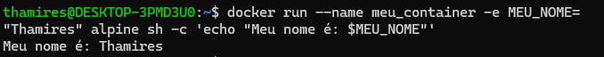

## 5. Crie um container com a imagem alpine passando uma variável de ambiente chamada MEU_NOME com seu nome. Execute o container e imprima o valor da variável com o comando echo.

### Passo a passo:

- Criar e executar o container Alpine com a variável de ambiente
```bash
docker run --rm --name meu_container -e MEU_NOME="Seu nome" alpine sh -c 'echo "Meu nome é: $MEU_NOME"'
```

- ```docker run```: executa uma nova instância de container
- ```-e MEU_NOME="Seu nome"```: definir a variável de ambiente com seu nome
- ```--rm```: remove o container automaticamente após a execução
- ```alpine```: especifica a imagem base do container (alpine)
- ```sh -c 'echo "Meu nome é: $MEU_NOME"'```: executado dentro do container para imprimir o valor da variável 

- Saída no terminal



- Executar o container em modo interativo:
```bash
docker run -it --name meu_container -e MEU_NOME="Thamires" alpine sh
```

- Executar dentro do container
```bash
echo "Meu nome é: $MEU_NOME"
```

- Saída:
```bash
Meu nome é: Thamires
```