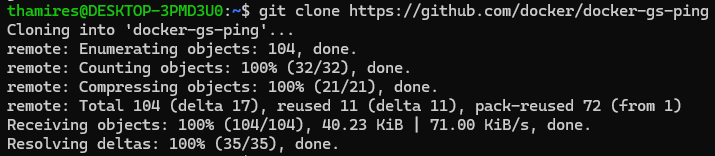
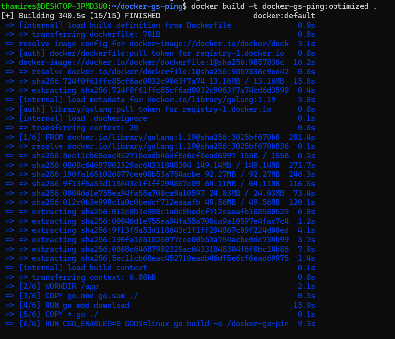
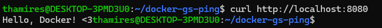

## 6. Utilize um multi-stage build para otimizar uma aplicação Go, reduzindo o tamanho da imagem final. Utilize para praticar o projeto GS PING desenvolvido em Golang.

- Clonar o repositório
```bash
git clone https://github.com/docker/docker-gs-ping
```

- No terminal:



- Entrar
```bash
cd docker-gs-ping
```


- Criar um arquivo Dockerfile no Vscode e digitar o seguinte código
```bash
# Build (compilação)
FROM golang:1.21-alpine AS builder

WORKDIR /app

# Copiar arquivos do projeto
COPY go.mod go.sum ./
RUN go mod download

# Copiar o código
COPY . .

# Compilar binário estático com otimizações
RUN CGO_ENABLED=0 GOOS=linux go build \
-ldflags="-s -w \ 
-o / docker-gs-ping

# Runtime
FROM alpine:3.19

WORKDIR /
# Copiar apenas o binário do estágio builder
COPY --from=builder /docker-gs-ping /docker-gs-ping

# Adicionar cerificados CA
RUN apk --no-cache add ca-certificates

# Porta exposta
EXPOSE 8080

# Usar usuário não-root
USER 1001:1001

# Ponto de entrada
ENTRYPOINT ["/docker-gs-ping"]
```

- Construir a imagem
```bash
docker build -t docker-gs-ping:optimized .
```

- Construção da imagem



- Verificar o tamanho e executar
```bash
docker images | grep docker-gs-ping
docker run -d -p 8080:8080 docker-gs-ping:optimized
```

- Testar o funcionamento
```bash
curl http://localhost:8080
```

- Saída:



### Referências
[Como fazer uma imagem Docker com multi stage build](https://aprendagolang.com.br/como-fazer-uma-imagem-docker-otimizada-com-multi-stage-build/)