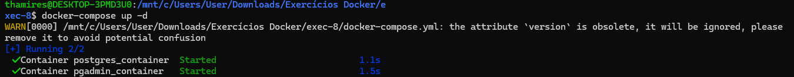
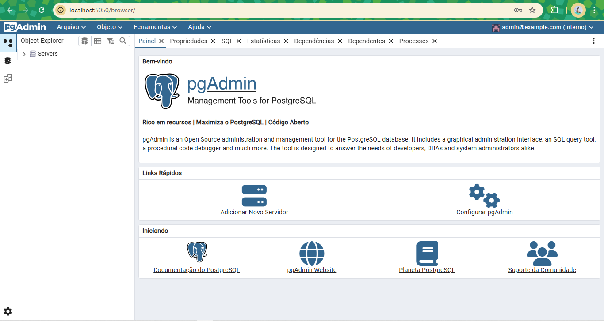

## 8. Utilize Docker Compose para configurar uma aplicação com um banco de dados PostgreSQL, use para isso o projeto pgadmin.

- Criar o arquivo docker-compose.yml
```yml
version: '3.8'

services:
  postgres:
    image: postgres:latest
    container_name: postgres_container
    environment:
      POSTGRES_USER: admin
      POSTGRES_PASSWORD: secret
      POSTGRES_DB: mydatabase
    volumes:
      - postgres_data:/var/lib/postgresql/data
    ports:
      - "5432:5432"
    networks:
      - app_network
    restart: unless-stopped

  pgadmin:
    image: dpage/pgadmin4:latest
    container_name: pgadmin_container
    environment:
      PGADMIN_DEFAULT_EMAIL: ada@wong.com
      PGADMIN_DEFAULT_PASSWORD: dina123
    ports:
      - "5050:80"
    networks:
      - app_network
    restart: unless-stopped
    depends_on:
      - postgres

volumes:
  postgres_data:

networks:
  app_network:
    driver: bridge
```

```version: "3.8"```: Define a versão do formato do arquivo Docker Compose.

```services```: Define os serviços a serem executados.
postgres:

```image: postgres:latest```: Utiliza a imagem oficial do PostgreSQL.

```environment```: Define as variáveis de ambiente para o PostgreSQL, como usuário, senha e nome do banco de dados.

```volumes```: Mapeia um volume persistente para os dados do PostgreSQL.

- Iniciar os containers
```bash
docker-compose up -d
```

- Captura de tela:



- Verificar se os containers estão rodando
```bash
docker ps
```

- Acessar o pgAdmin
```bash
http://localhost:5050
```

- Visualizando a página
